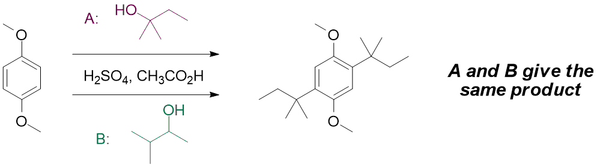
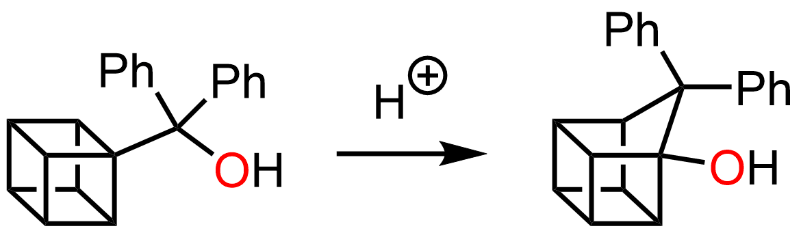
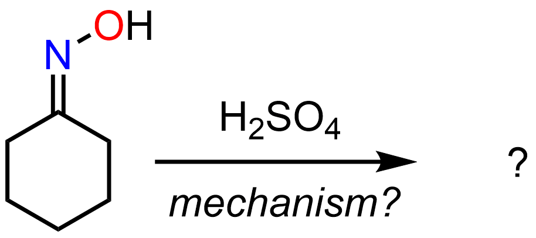

#### How and why do carbocations rearrange? Rearrangements to N and O, and some radical ideas
Week 2 focuses on the rearrangements of carbocations, rearrangement reactions where R groups migrate to nitrogen or oxygen atoms, and radical reactions in organic chemistry. Click through for the full details...

#### Readings
[_Organic Chemistry_, 3rd ed. by Klein, Chapter 6 - Chemical Reactivity and Mechanisms](https://ebookcentral-proquest-com.libraryproxy.griffith.edu.au/lib/griffith/reader.action?docID=4806589&ppg=246)
[_Organic Chemistry_, 3rd ed. by Klein, Section 19.11 - The Baeyer-Villiger oxidation](https://ebookcentral-proquest-com.libraryproxy.griffith.edu.au/lib/griffith/reader.action?docID=4806589&ppg=901)
[_Organic Chemistry_, 3rd ed. by Klein, Chapter 10 - Radical Reactions](https://ebookcentral-proquest-com.libraryproxy.griffith.edu.au/lib/griffith/reader.action?docID=4806589&ppg=455)

===

### Cycle 1: Reaction mechanisms (cont'd)  

#### Before the lectures  

For the second half of this cycle, you will need to finish reading [Chapter 6 of Klein]((https://ebookcentral-proquest-com.libraryproxy.griffith.edu.au/lib/griffith/reader.action?docID=4806589&ppg=246)) if you haven't already done so. You should also read about the Baeyer-Villiger oxidation ([Section 19.11](https://ebookcentral-proquest-com.libraryproxy.griffith.edu.au/lib/griffith/reader.action?docID=4806589&ppg=901)) and radical reactions ([Chapter 10 of Klein](https://ebookcentral-proquest-com.libraryproxy.griffith.edu.au/lib/griffith/reader.action?docID=4806589&ppg=455)) and watch the following _Key Concept_ videos.  

##### Carbocation rearrangements  
Why do the reactions below both give the same product, despite using different alcohol reagents?

  

The key is to look at the carbocation intermediates formed and how they can rearrange.  

**_Please note: there is currently an issue with all YouTube videos on this page where the image freezes and audio continues. The current workaround is to watch the video at 1080p resolution. All other resolutions have this problem. I have contacted YouTube - it looks to be a problem that many people are currently experiencing, and that they are looking to rectify._**

[plugin:youtube](https://youtu.be/embed/W6ZMWTLAkU4?vq=hd1080)  

Here's an interesting molecule for you - a "cubane"! The particular cubane shown below is very sensitive, and rearranges to a "homocubane" when exposed to even very mild acid. How do you think this might occur?  

  

Apart from the textbook, there are also great posts about [hydride shifts](https://www.masterorganicchemistry.com/2012/08/15/rearrangement-reactions-1-hydride-shifts/) and [alkyl shifts](https://www.masterorganicchemistry.com/2012/08/22/rearrangement-reactions-2-alkyl-shifts/) at Master Organic Chemistry (MOC).  

##### Rearrangements to nitrogen  

Moving away from carbocations, but sticking with the rearrangement theme, there are several reactions that involve migration of an "R" group to a nitrogen atom. Two of the most useful and important are the [Curtius rearrangement](https://www.masterorganicchemistry.com/2017/09/19/hofmann-and-curtius-rearrangements/) and the [Beckmann rearrangement](https://www.masterorganicchemistry.com/reaction-guide/beckmann-rearrangement/).

[plugin:youtube](https://youtu.be/3YZzRZWObJg)  

Now that you've seen the video, try drawing out the mechanism for the Beckmann rearrangement of a cyclic oxime:  

  

##### Rearrangements to oxygen  

We wouldn't want oxygen to miss out on all the fun that nitrogen is having! Rearrangements to oxygen are also known and arguably the most important is the [Baeyer-Villiger oxidation](https://www.name-reaction.com/baeyer-villiger-oxidation), which uses a "peracid" (peroxy carboxylic acid), eg. _m_-chloroperoxybenzoic acid (_m_-CPBA), to oxidise a ketone or aldehyde to an ester or carboxylic acid, respectively. The video below shows how this reaction works with ketones.  

[plugin:youtube](https://youtu.be/FIJ7N1DXLwU)  

##### Radical reactions  

The last topic in cycle 1 is [radical reactions](https://www.masterorganicchemistry.com/2013/12/09/in-summary-free-radicals/). The textbook gives a very nice, thorough introduction to radical reactions in organic chemistry. One of the interesting, key concepts that relates back to the early part of this cycle and the [Hammond postulate](https://www.youtube.com/watch?v=Et0Y7z-sLUg) is the curious observation that radical chlorinations of alkanes are generally much less selective than radical brominations:  

[plugin:youtube](https://youtu.be/c5enwHzAwmA)  

So, what would be the major product of radical bromination of 2-methylbutane? Are there any situations in which you might expect radical _chlorination_ of an alkane to be more selective than radical _bromination_?

If you would like to explore this topic in more detail, particularly from the physical organic chemistry point of view, MOC has [an extremely detailed post here](https://www.masterorganicchemistry.com/2013/10/31/selectivity-in-free-radical-reactions-bromine-vs-chlorine/).

### Further information  

#### Week 1 Lecture notes  
[Cycle 1: Lecture 3 - Rearrangements](https://bblearn.griffith.edu.au/bbcswebdav/xid-22480861_1)  
[Cycle 1: Lecture 4 - Radical reactions](https://bblearn.griffith.edu.au/bbcswebdav/xid-22480863_1)  

#### Further video resources  
If you would like further explanation of these concepts in long-form lecture format, below are the lecture capture recordings for this cycle from 2017. _Note:_ You need to be logged in through Griffith University to access.  
[Reaction mechanisms - Lecture 3](https://echo360.org.au/media/6bff5d81-a306-4fc2-b14a-261ef1c5fb9f/public)  
[Reaction mechanisms - Lecture 4](https://echo360.org.au/media/be7fea5b-6080-45ed-b642-71e56253c669/public)  

#### Supplemental Readings  
[Hydride shifts](https://www.masterorganicchemistry.com/2012/08/15/rearrangement-reactions-1-hydride-shifts/)  
[Alkyl shifts](https://www.masterorganicchemistry.com/2012/08/22/rearrangement-reactions-2-alkyl-shifts/)  
[The Curtius rearrangement](https://www.masterorganicchemistry.com/2017/09/19/hofmann-and-curtius-rearrangements/)  
[The Beckmann rearrangement](https://www.masterorganicchemistry.com/reaction-guide/beckmann-rearrangement/)  
[The Baeyer-Villiger oxidation](https://www.name-reaction.com/baeyer-villiger-oxidation)  
[Radical reactions](https://www.masterorganicchemistry.com/2013/12/09/in-summary-free-radicals/)  
[Selectivity in radical chlorination vs bromination of alkanes](https://www.masterorganicchemistry.com/2013/10/31/selectivity-in-free-radical-reactions-bromine-vs-chlorine/)  
