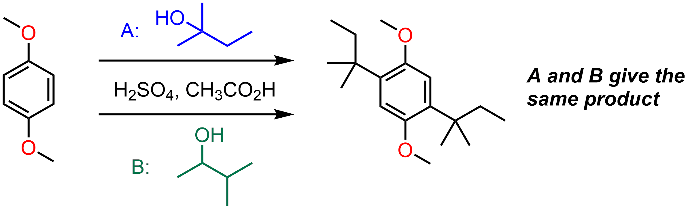

##### How and why do carbocations rearrange, rearrangements to N and O, and some radical ideas
Week 2 focuses on the rearrangements of carbocations, rearrangement reactions where R groups migrate to nitrogen or oxygen atoms, and radical reactions in organic chemistry. Click through for the full details...

##### Readings
[_Organic Chemistry_, 3rd ed. by Klein, Chapter 6 - Chemical Reactivity and Mechanisms](https://ebookcentral-proquest-com.libraryproxy.griffith.edu.au/lib/griffith/reader.action?docID=4806589&ppg=246)
[_Organic Chemistry_, 3rd ed. by Klein, Section 19.11 - The Baeyer-Villiger oxidation](https://ebookcentral-proquest-com.libraryproxy.griffith.edu.au/lib/griffith/reader.action?docID=4806589&ppg=901)
[_Organic Chemistry_, 3rd ed. by Klein, Chapter 10 - Radical Reactions](https://ebookcentral-proquest-com.libraryproxy.griffith.edu.au/lib/griffith/reader.action?docID=4806589&ppg=455)

===

### Cycle 1: Reaction mechanisms (cont'd)  

#### Before the lectures  

##### Carbocation rearrangements  
Why do the reactions below both give the same product, despite using different alcohol reagents?

  

The key is to look at the carbocation intermediates formed and how they can rearrange.  

[plugin:youtube](https://youtu.be/W6ZMWTLAkU4)

*EDIT FROM HERE*

For an unusual take on thermodynamic vs kinetic control, [read this post](https://www.masterorganicchemistry.com/2012/02/09/can-opener-economics/) at Master Organic Chemistry (MOC).  

##### The Hammond postulate  
Next up is the _Hammond postulate:_  

[plugin:youtube](https://www.youtube.com/watch?v=Et0Y7z-sLUg)  
Now that you've watched the video, _can you think of any situations where the postulate might be useful in predicting or explaining a reaction outcome?_ For further discussion of the Hammond postulate, read [this post](https://www.masterorganicchemistry.com/2011/09/28/hammonds-postulate/) at MOC.  

##### Curly arrows in ionic mechanisms  
Moving away from energy diagrams, perhaps the most important skill for an organic chemist in proposing a mechanism is the ability to "push" curly arrows. Here are some guidelines about the four types of steps that can be combined together to show mechanisms for the majority of organic reactions:  

[plugin:youtube](https://www.youtube.com/watch?v=OrIy0xpZgmA)  

I mention in that video that carbon atoms with 5 bonds are "against the rules". What rules am I talking about? Why is this the case? This is actually one of the most common mistakes made by undergraduate students in exams and quizzes. The pentavalent carbon atom, or [_"Texas carbon"_](https://www.masterorganicchemistry.com/common-mistakes-in-organic-chemistry-pentavalent-carbon/), sticks out like a sore thumb to experienced chemists. _What tricks could you use to avoid making a "Texas carbon" mistake in a quiz?_  

### Further information  

#### Week 1 Lecture notes  
[Cycle 1: Introduction](https://bblearn.griffith.edu.au/bbcswebdav/xid-21775152_1)  
[Cycle 1: Lectures 1-2](https://bblearn.griffith.edu.au/bbcswebdav/xid-21775154_1)  

#### Further video resources  
If you would like further explanation of these concepts in long-form lecture format, below are the lecture capture recordings for this cycle from 2017. _Note:_ You need to be logged in through Griffith University to access.  
[Reaction mechanisms - Lecture 3](https://echo360.org.au/media/6bff5d81-a306-4fc2-b14a-261ef1c5fb9f/public)  
[Reaction mechanisms - Lecture 4](https://echo360.org.au/media/be7fea5b-6080-45ed-b642-71e56253c669/public)  

#### Supplemental Readings  
[Kinetics vs thermodynamics](https://www.masterorganicchemistry.com/2012/02/09/can-opener-economics/)  
[The Hammond postulate](https://www.masterorganicchemistry.com/2011/09/28/hammonds-postulate/)  
[Common mistakes in organic chemistry - the pentavalent carbon atom](https://www.masterorganicchemistry.com/common-mistakes-in-organic-chemistry-pentavalent-carbon/)
