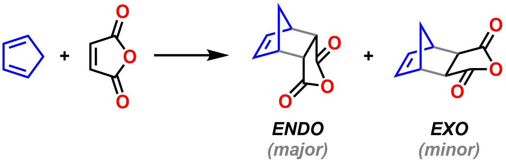

#### Readings - Pericyclic reactions
[Klein, Chapter 16, Sections 16.1-16.10 - Conjugated Pi Systems and Pericyclic Reactions](https://ebookcentral-proquest-com.libraryproxy.griffith.edu.au/lib/griffith/reader.action?docID=4806589&ppg=721)  

===

### Cycle 3: Pericyclic reactions  

#### Before the lectures  

To prepare for this cycle, you should read [Sections 16.1-16.10 from Klein](https://ebookcentral-proquest-com.libraryproxy.griffith.edu.au/lib/griffith/reader.action?docID=4806589&ppg=721), all of which are assessable. The early sections (16.1-16.7) may be familiar from previous organic chemistry courses.  

The most relevant problems from this chapter are 16.39, 16.40, 16.42-16.46, 16.50-16.58, 16.64-16.68, 16.70-16.72 and 16.74-16.76. Problems 16.78-16.81 are good for a challenge!  

#### Pi molecular orbitals  

To understand pericyclic reactions, it is important to comprehend conjugated pi systems and particularly the pi molecular orbitals that are produced by combining contiguous p orbitals. Can you arrange the following pi molecular orbitals from lowest to highest in energy?  

[h5p url="https://organicchemexplained.com/wp-admin/admin-ajax.php?action=h5p_embed&id=3"]

#### Types of pericyclic reactions  

There are three types of pericyclic reaction, each involving different numbers of &sigma; and &pi; bonds being formed and broken. However, all pericyclic reactions have some key features in common:  

[plugin:youtube](https://youtu.be/cib2EKbny9E)

#### Cycloaddition reactions  
Among cycloaddition reactions, the Diels&ndash;Alder reaction is the most common and most important. There are a number of key features to master:  

[plugin:youtube](https://youtu.be/TvPZvE2wCCY)

However, regioselectivity is sufficiently complex to deserve its own video:  

[plugin:youtube](https://youtu.be/cFGgZ7BtzKY)  

A classic example of the Diels&ndash;Alder reaction is that between cyclopentadiene and maleic anhydride. The reaction is very fast at room temperature due to the high reactivity of both the diene and dienophile. Cyclopentadiene is held in the s-_cis_ conformation with both reactive ends of the diene system held close together by the 5-membered ring. Maleic anhydride is a reactive dienophile due to the two electron-withdrawing carbonyl groups. Here are interactive models of the calculated diene HOMO and dienophile LUMO. Note that they are more complex than the approximations we do on paper by simply adding together p orbitals - real molecular orbitals involve all atoms within the molecule. However, you can see the orbitals are largest at the sites of reaction, and you should also be able to see that the phases of each are suitable for the [4+2]-cycloaddition to occur.  

| Cyclopentadiene HOMO | Maleic anhydride LUMO |
| -------------------- | --------------------- |
| 

 | 

 |  

Another important feature is the overwhelming selectivity for the _endo_ vs the thermodynamically more stable _exo_ isomer.  

  

| Endo product | Exo product |
| -------------------- | --------------------- |
| 

 | 

 |  

There has been very active debate for decades about why Diels&ndash;Alder reactions are normally selective for the endo products, and several theories have been advanced. One of the most highly accepted has been 'secondary orbital interactions' - see page 2 of [these notes](http://www.massey.ac.nz/~gjrowlan/stereo/lecture8.pdf). However, like many useful theories, it is probably not highly accurate. The bottom line is that the endo products are kinetically favoured and therefore the transition state leading to the endo product must be lower in energy than that leading to the exo product. Recent density functional theory (DFT) level calculations have shed further light on the nature of this selectivity. For this course, we will simply note endo selectivity as a general, empirical rule and move along.  

| Endo transition state | Exo transition state |
| -------------------- | --------------------- |
| 

 | 

 |  

### Cycle 1: Reaction mechanisms  

#### Before the lectures  
Reaction mechanisms fascinate organic chemists. Why is that? A mechanism, like any scientific theory, can never be _proven_. So, why bother? Have a think about it and we will discuss it in class.  

For this cycle, you will need to read [Chapter 6 of Klein]((https://ebookcentral-proquest-com.libraryproxy.griffith.edu.au/lib/griffith/reader.action?docID=4806589&ppg=246)) and watch the following _Key Concept_ videos. Do it in either order - whatever works for you.

##### Kinetic vs thermodynamic control  
A key concept to master in organic chemistry is the difference between _kinetic_ and _thermodynamic_ control in reaction outcomes. As you watch this video, consider this question - _why is there sometimes a difference between the kinetic and the thermodynamic products of a reaction?_  

For an unusual take on thermodynamic vs kinetic control, [read this post](https://www.masterorganicchemistry.com/2012/02/09/can-opener-economics/) at Master Organic Chemistry (MOC).  

##### The Hammond postulate  
Next up is the _Hammond postulate:_  

[plugin:youtube](https://www.youtube.com/watch?v=Et0Y7z-sLUg)  
Now that you've watched the video, _can you think of any situations where the postulate might be useful in predicting or explaining a reaction outcome?_ For further discussion of the Hammond postulate, read [this post](https://www.masterorganicchemistry.com/2011/09/28/hammonds-postulate/) at MOC.  

##### Curly arrows in ionic mechanisms  
Moving away from energy diagrams, perhaps the most important skill for an organic chemist in proposing a mechanism is the ability to "push" curly arrows. Here are some guidelines about the four types of steps that can be combined together to show mechanisms for the majority of organic reactions:  

I mention in that video that carbon atoms with 5 bonds are "against the rules". What rules am I talking about? Why is this the case? This is actually one of the most common mistakes made by undergraduate students in exams and quizzes. The pentavalent carbon atom, or [_"Texas carbon"_](https://www.masterorganicchemistry.com/common-mistakes-in-organic-chemistry-pentavalent-carbon/), sticks out like a sore thumb to experienced chemists. _What tricks could you use to avoid making a "Texas carbon" mistake in a quiz?_  

### Further information  

#### Week 1 Lecture notes  
[Cycle 1: Introduction](https://bblearn.griffith.edu.au/bbcswebdav/xid-21775152_1)  
[Cycle 1: Lectures 1-2](https://bblearn.griffith.edu.au/bbcswebdav/xid-21775154_1)  

#### Further video resources  
If you would like further explanation of these concepts in long-form lecture format, below are the lecture capture recordings for this cycle from 2017. _Note:_ You need to be logged in through Griffith University to access.  
[Reaction mechanisms - Lecture 1](https://echo360.org.au/media/4e2623ca-5bab-4a9c-a73c-43f941969495/public)  
[Reaction mechanisms - Lecture 2](https://echo360.org.au/media/358e9ae5-1fb8-41f1-8aa1-c472106e5946/public)  

#### Supplemental Readings  
[Kinetics vs thermodynamics](https://www.masterorganicchemistry.com/2012/02/09/can-opener-economics/)  
[The Hammond postulate](https://www.masterorganicchemistry.com/2011/09/28/hammonds-postulate/)  
[Common mistakes in organic chemistry - the pentavalent carbon atom](https://www.masterorganicchemistry.com/common-mistakes-in-organic-chemistry-pentavalent-carbon/)
