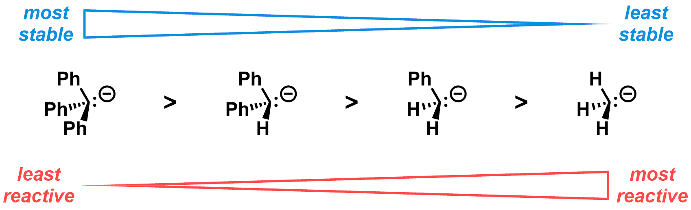
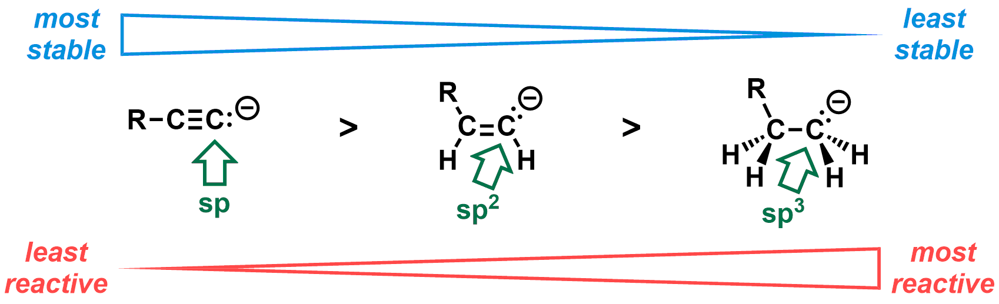
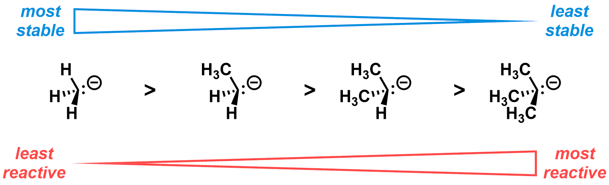

#### Readings - Organometallic Reactions
[Klein, Chapter 23](https://ebookcentral-proquest-com.libraryproxy.griffith.edu.au/lib/griffith/reader.action?docID=4806589&ppg=1074)  

===

### Cycle 4: Organometallic Reactions  

#### Organometallic reagents  

The reactivity of organometallic reagents is heavily influenced by the nature of the metal. The difference in electronegativity between the carbanion component (carbon) and the metal relates strongly to the reactivity of the organometallic compound, ie. in general, the larger the electronegativity difference, the more reactive the organometallic compound.    

[plugin:youtube](https://youtu.be/kjxYJ3MymuA)  

Given the above information, and using electronegativity values listed in your notes or your textbook, try this question:  

[h5p url="https://organicchemexplained.com/wp-admin/admin-ajax.php?action=h5p_embed&id=5"]

Aside from the metal, the organic (carbanion) component also influences reactivity. The guidelines and reasoning are outlined in the lecture notes, and can be summarised by three rules (in order of importance):

**1. The more highly conjugated, the more stable and therefore less reactive, eg.:**  
  

---

**2. The more "s-character" of the carbon bearing the negative charge, the more stable (ie. less reactive):**  

---

**3. For saturated carbanions, ie. sp3-hybridized carbanion carbon and no conjugation, greater substitution leads to lower stability (higher reactivity):**  
  

---

Check your understanding with the following question:  

[h5p url="https://organicchemexplained.com/wp-admin/admin-ajax.php?action=h5p_embed&id=6"]

#### Transition metal-catalyzed cross coupling reactions  

Transition metal catalysts can be used to generate new C-C bonds between functionalized organic compounds through what are known as _cross coupling reactions._ While the specific details vary from one reaction to the next, there are some steps that are common to all the cross-coupling reactions discussed here:  

[plugin:youtube](https://youtu.be/HlsVbDXqXlY)  

Cross coupling reactions are incredibly useful and it is safe to say that without them, many materials, from drugs used to treat diseases, to materials present in modern devices, would not be with us today. Three of the pioneers of palladium-catalyzed cross coupling chemistry, Richard Heck, Ei-ichi Negishi and Akira Suzuki, shared the [2010 Nobel Prize in Chemistry](https://www.nobelprize.org/nobel_prizes/chemistry/laureates/2010/) for their discoveries - see the photo in the header of this post. Another chemist, [John Stille](https://en.wikipedia.org/wiki/John_Kenneth_Stille), developed a cross coupling reaction using organotin compounds (organostannanes) in the late 1970's. He may have also shared the 2010 Nobel Prize, except he met an untimely death in a plane crash in 1989.1  

Here I talk about some of the key features of the Stille, Suzuki(-Miyaura), Negishi and Heck reactions:  

[plugin:youtube](https://youtu.be/8ATLlV5GvyE)  

Practice these concepts with this drag & drop quiz:  

[h5p url="https://organicchemexplained.com/wp-admin/admin-ajax.php?action=h5p_embed&id=7"]

### Further information  

#### Cycle 4 Lecture notes  
[Cycle 4: Lecture notes](https://bblearn.griffith.edu.au/bbcswebdav/xid-24942352_1)  

#### Practice problems  
The most relevant problems from Klein (3rd ed.) are 23.33, 23.37, 23.40, 23.43-23.45, 23.49, 23.52 and 23.54-23.61. Problems 23.71-23.72, 23.74-23.75 are good for a challenge!  

#### Supplemental Readings  
[Reaction Map: Reactions of Organometallics](https://www.masterorganicchemistry.com/2016/04/11/reaction-map-reactions-of-organometallics/)  
[What's An Organometallic?](https://www.masterorganicchemistry.com/2015/10/28/whats-an-organometallic/)  
[Synthesis of Grignard and Organolithium Reagents](https://www.masterorganicchemistry.com/2015/11/09/synthesis-of-grignard-and-organolithium-reagents/)  
[Gilman Reagents (Organocuprates): How They’re Made](https://www.masterorganicchemistry.com/2016/01/29/gilman-reagents-organocuprates-how-theyre-made/)  
[Gilman Reagents (Organocuprates): What They’re Used For](https://www.masterorganicchemistry.com/2016/02/05/gilman-reagents-organocuprates-what-theyre-used-for/)  

###### Footnotes  
1The Nobel Prize is not awarded posthumously.
